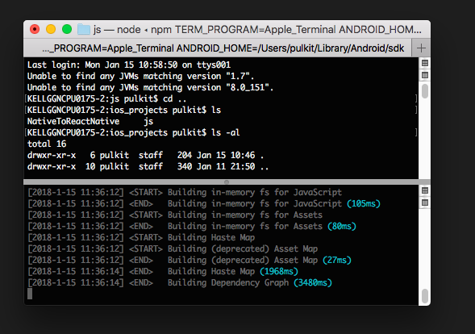

# integrating-react-native-to-existing-ios-app
Add Rect-Native Component in ios native app and pass data to it.

## Steps For Running This Project

### Step 1:
Open the terminal and run this command.  

`$git clone https://github.com/PulkitAgg/integrating-react-native-to-existing-ios-app.git`

### Step 2:
Migrate to the project which is cloned right now i.e run this commmand.   

`cd integrating-react-native-to-existing-ios-app/`

### Step 3:
Now install the require modules for react-native.  

`cd js/`  
`npm install`

### Step 4: 
Now start the server for react-native.  
`npm start`  
After a few seconds, you should see something like this
  
 .  

### Step 5:
Open XCode in your mac and open NativeToReactNative folder and select NativeToReactNAtive.xcworkspace.  

### Step 6:
Run your code through xcode and now you can check your simulator. You can enter your name in text field and this name will be shown in react-native component.
